# [Project Title: Using Unwrapped Full Color Space Palette Recording to Measure Exposedness of a Vehicle Exterior Parts for External Human Machine Interfaces]

<!-- > [!IMPORTANT]
> **Lab Repository Rules:**
> 1. **Do not upload data:** Ensure all datasets are kept in the `data/` folder (which is git-ignored).
> 2. **No Heavy Weights:** Do not push `.pth` or `.h5` files over 50MB. Use the lab's shared storage instead.
> 3. **Environment:** Always provide a `requirements.txt` or `environment.yml`. -->

---

## 🔗 Metadata
* **Authors:** Jose Gonzalez-Belmonte, and Jaerock Kwon
<!-- * **Venue:** [e.g., CVPR 2026 / Nature Communications] -->
* **Status:** In Progress
* **Paper/Project Link:** https://arxiv.org/abs/2604.11406

---

## 📌 Research Overview
* **Problem:** Develop a granular automated system to find out what exterior parts of a vehicle are visible to pedestrians in order to find out the best placement for a external human-machine interface.
* **Method:** We generated a texture containing every color in the 32-bit color space (referred to as a Full Color Space Palette, or FCSP), then downloaded the 3D model of a 2015 F150 King Ranch and unwrapped its faces onto said FCSP. This provided us a 3D model where every single pixel of its projected texture was a unique color not found anywhere else on it. We then simulated four scenarios of the vehicle turning a corner and driving towards a four-way intersection where a pedestrian is waiting. 
* **Key Contribution:** By analyzing the video recording of these encounters frame-by-frame pixel-by-pixel, we were able to collect data on what points of the vehicle were visible most often to the observing pedestrian. This was also compared agaisnt a texture mapping each of the vehicle's exterior parts, which provided us information on the individual vehicle exterior parts as well. The technique developed for this paper, which we called Unwrapped Full Color Space Recording (UFSCR), has not been documented before, and it provides a method to measure the visibility of an object to a camera in a 3D virtual environment significantly more efficient than ray-casting.

<p align="center">
  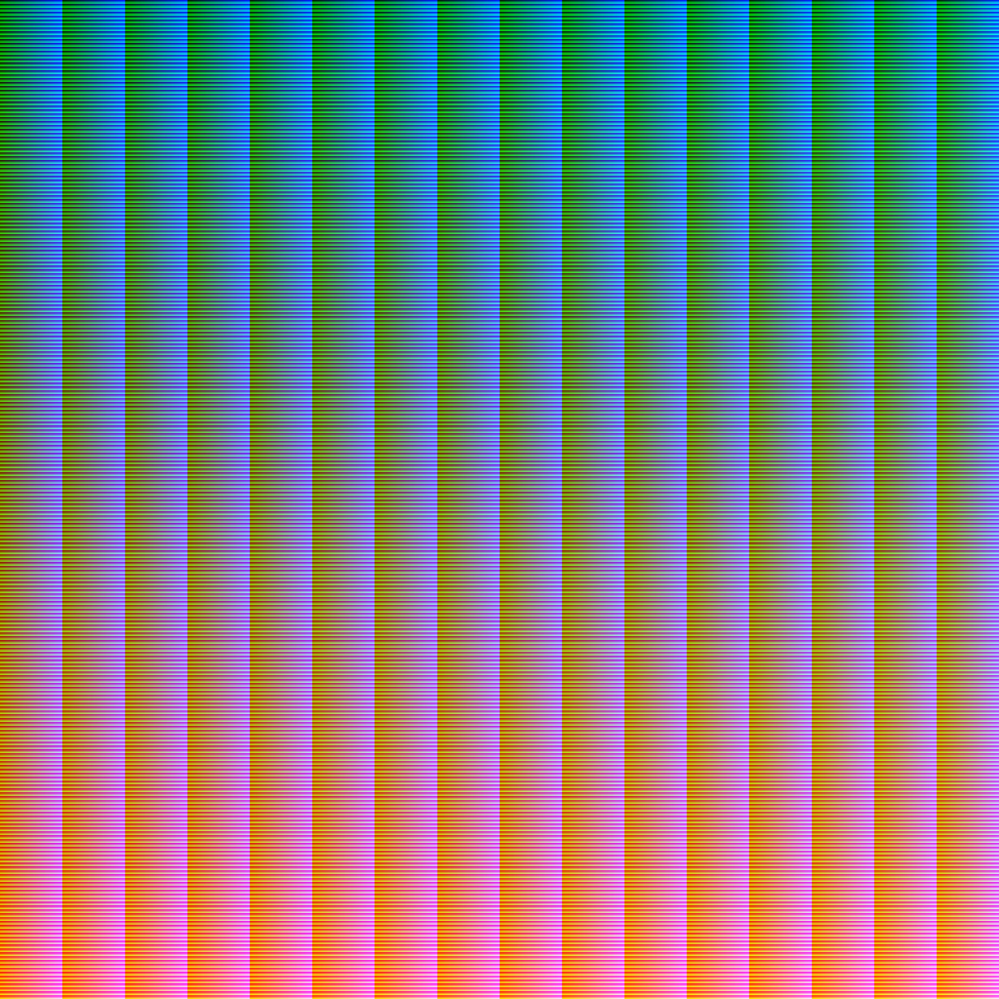
  <br><em>Figure 1: A rendition of Full Color Space Palette (FCSP) generated for this study, compressed for formatting purposes. Each pixel is a unique not present anywhere else in the image.</em>
</p>

<p align="center">
  
  <br><em>Figure 2: Faces of the F-150 King Ranch mesh unwrapped onto the FCSP.</em>
</p>

<p align="center">
  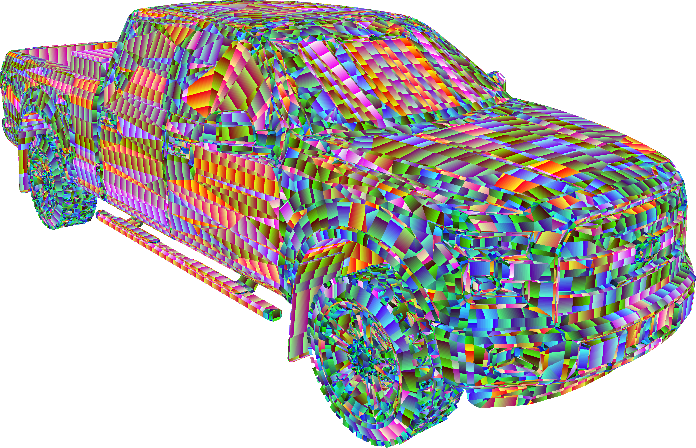
  <br><em>Figure 3: The vehicle model in the 3D engine with the FCSP assigned as its texture.</em>
</p>

<p align="center">
  
  <br><em>Figure 4: Comparison of the environment geometry (top) with its appearance after the unlit material has been applied to it (bottom).</em>
</p>

---

## 🚀 Usage

* The scene "Assets/Scenes/CityAnimation.unity" controls the animations and the recording. Numbers 1-4 on the numberpad will play and start recording scenarios A, B, C, and D respectively. The frames can be found in "C:\Users\\\[YourUserName]\AppData\LocalLow\JoseGonzUoMD\VisibilityProject\"
<p align="center">
  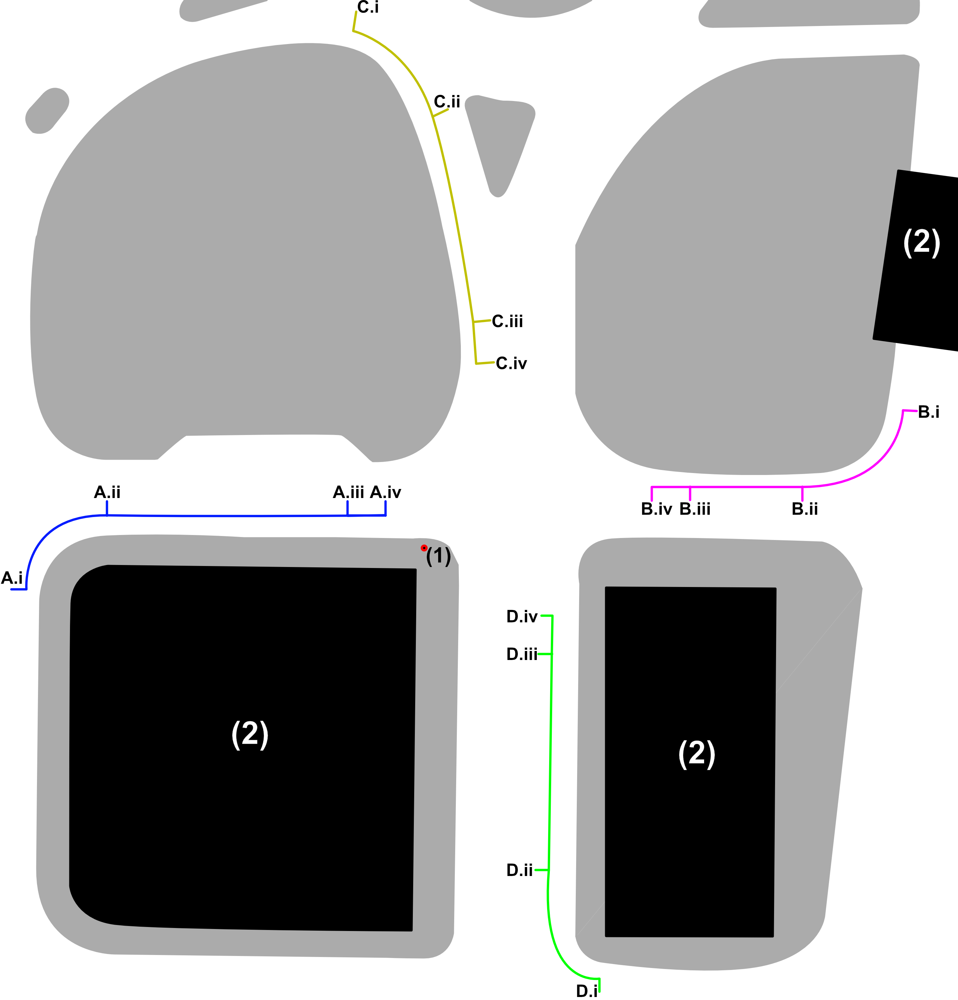
  <br><em>Figure 5: Illustration of the vehicle trajectory at each of the scenarios, as well as the position of the camera (1) and buildings (2). (A) Vehicle approaches from the West; (B) vehicle approaches from the East; (C) vehicle approaches from the North; (D) vehicle approaches from the South. (A-D).i is the vehicle position at the 0:00 timestamp; (A-D).ii is the vehicle position at 1:30; (A-D).iii is the vehicle position at 2:30; (A-D).iv is the vehicle position at 3:00.</em>
</p>

* The scenes "Assets/Scenes/IndividualAnalysisScene.unity" and "Assets/Scenes/SymmetricalAnalysisScene.unity" both contain the script that analyzes the generated images in the game object _Manager_. 

    * The main difference is during the analysis of exterior parts. _IndividualAnalysisScene.unity_, treats left and right parts as separate, while _SymmetricalAnalysisScene.unity_ treats them as a single part.

    * To process recorded data, change the _PPathFolderName_ variable to the name of the folder inside of "C:\Users\\\[YourUserName]\AppData\LocalLow\JoseGonzUoMD\VisibilityProject\" that contains the frames you would like to analyze. 

        * The texture containing the heatmap of visibility will be generated in the project with the name in the _File Name_ variable. 
        * The file containing the report of the vehicle exterior parts can be found in "C:\Users\\\[YourUserName]\AppData\LocalLow\JoseGonzUoMD\VisibilityProject\PartReports\" under the name "[File Name]_part_report.csv

<!-- ---

## 🚀 Usage

### Training
```bash
python main.py --mode train --config configs/default.yaml --batch_size 64
```

### Evaluation / Inference
```bash
python main.py --mode test --checkpoint ./checkpoints/best_model.pth
```

---

## 📂 Repository Structure
* `data/` - Datasets and processed pickles (Git-ignored)
* `models/` - Model definitions and backbone architectures
* `utils/` - Shared helper functions (metrics, visualization)
* `configs/` - Hyperparameter configuration files (YAML/JSON)
* `scripts/` - Shell scripts for cluster job submission (SLURM/SGE)
* `checkpoints/` - Saved model weights (Git-ignored) -->

---

## 📊 Results & Key Metrics


<p align="center">
  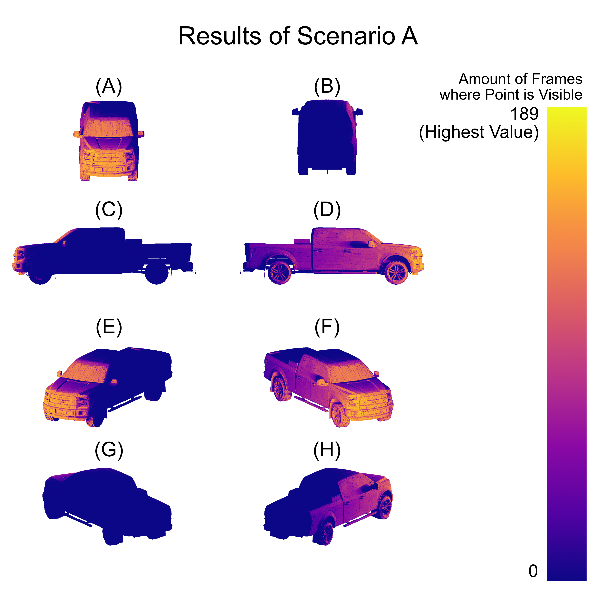
  <br><em>Figure 5: Pictures showing the exposedness of the exterior of the vehicle when it approaches a pedestrian from the left, stopping before a crosswalk. (A) Front, (B) Rear, (C) Left side, (D) Right Side, (E) Front-Left Side, (F) Front-Right Side, (G) Back-Left Side, (H) Back-Right Side.</em>
</p>
<p align="center">
  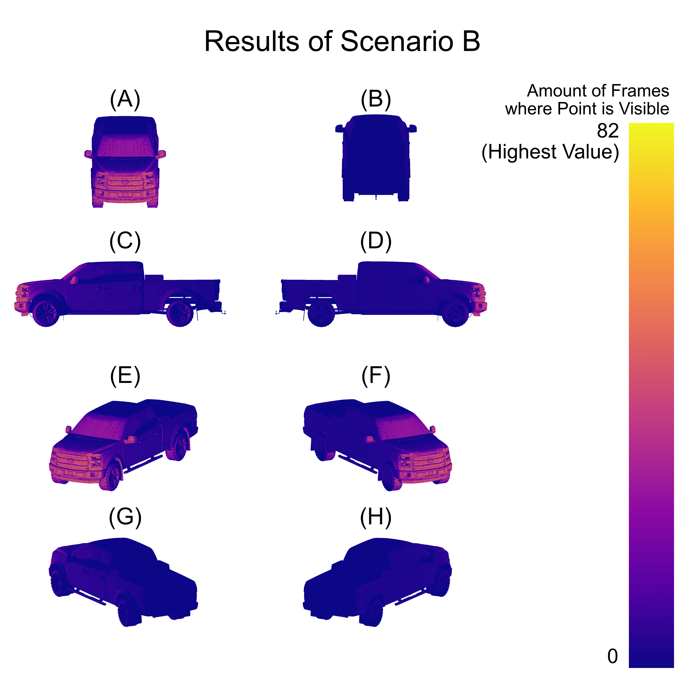
  <br><em>Figure 6: Pictures showing the exposedness of the exterior of the vehicle when it approaches a pedestrian from the right, stopping before a crosswalk. (A) Front, (B) Rear, (C) Left side, (D) Right Side, (E) Front-Left Side, (F) Front-Right Side, (G) Back-Left Side, (H) Back-Right Side.</em>
</p>
<p align="center">
  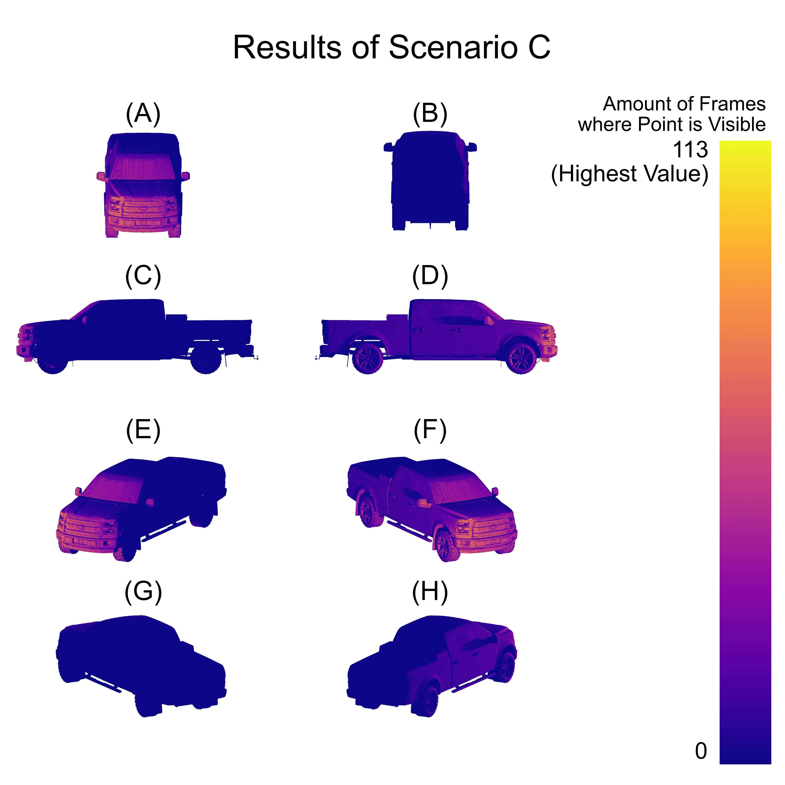
  <br><em>Figure 7: Pictures showing the exposedness of the exterior of the vehicle when it approaches a pedestrian from the front, stopping before a crosswalk. (A) Front, (B) Rear, (C) Left side, (D) Right Side, (E) Front-Left Side, (F) Front-Right Side, (G) Back-Left Side, (H) Back-Right Side.</em>
</p>
<p align="center">
  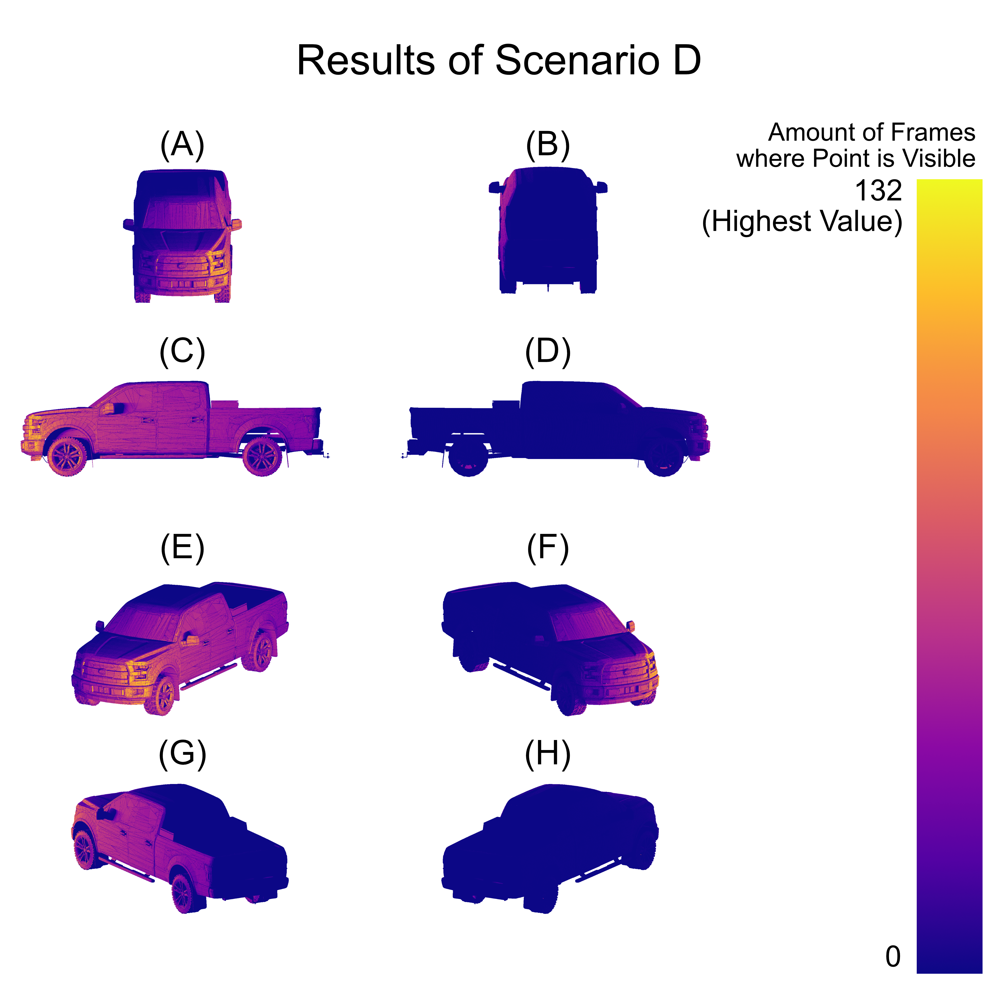
  <br><em>Figure 8: Pictures showing the exposedness of the exterior of the vehicle when it’s approaching a pedestrian from behind, stopping before a crosswalk. (A) Front, (B) Rear, (C) Left side, (D) Right Side, (E) Front-Left Side, (F) Front-Right Side, (G) Back-Left Side, (H) Back-Right Side.</em>
</p>

<p align="center">
  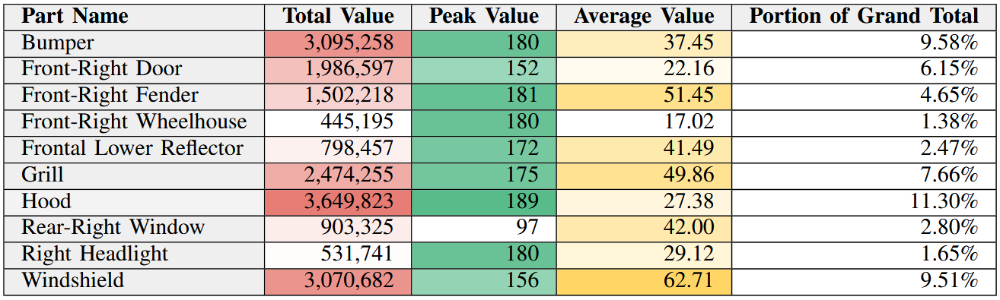
  <br><em>Figure 9: Individual vehicle exterior parts that are among the five with the highest total value, average value, or peak value, for Scenario A where the vehicle is coming from the west.</em>
</p>
<p align="center">
  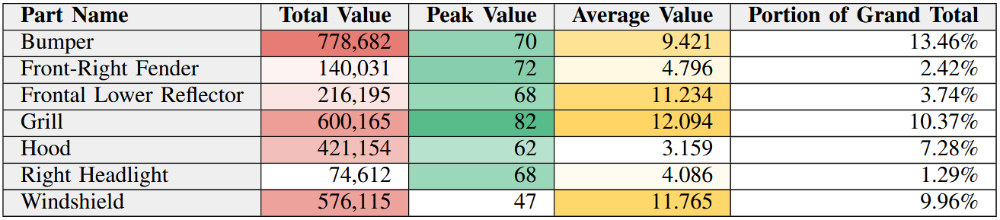
  <br><em>Figure 10: Individual vehicle exterior parts that are among the five with the highest total value, average value, or peak value, for Scenario B where the vehicle is coming from the east.</em>
</p>
<p align="center">
  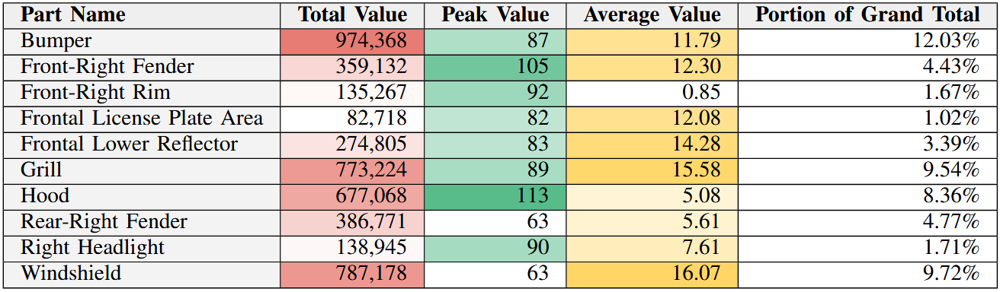
  <br><em>Figure 11: Individual vehicle exterior parts that are among the five with the highest total value, average value, or peak value, for Scenario C where the vehicle is coming from the north.</em>
</p>
<p align="center">
  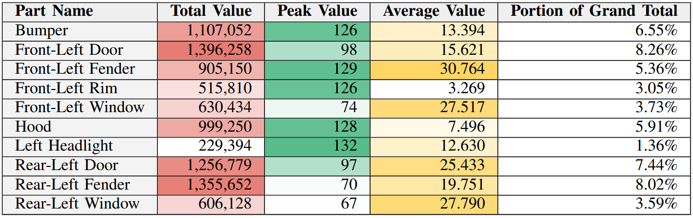
  <br><em>Figure 12: Individual vehicle exterior parts that are among the five with the highest total value, average value, or peak value, for Scenario D where the vehicle is coming from the south.</em>
</p>

---

## 📜 Citation
If you use this code in your research, please cite:
```bibtex
@article{bimi2026ufcsr,
  title={Using Unwrapped Full Color Space Palette Recording to Measure Exposedness of a Vehicle Exterior Parts for External Human Machine Interfaces},
  author={Gonzalez-Belmonte, Jose and Kwon, Jaerock},
  journal={Unpublished},
  year={2026}
}
```

---

## 📧 Contact
* **Primary Researcher:** Jose Gonzalez-Belmonte (josegonz@umich.edu)
* **Laboratory:** Bio-Inspired Machine Intelligence, University of Michigan-Dearborn
* **Lab Website:** http://bimi.jrkwon.com/
